# AI-900 | Lendo texto em imagens

Repositório do passo a passo criado para o desafio **Reconhecimento Facial e transformação de imagens em Dados no Azure ML**, durante o bootcamp [*Microsoft Azure AI Fundamentals*](https://www.dio.me/bootcamp/microsoft-azure-ai-fundamentals).

O objetido aqui é obter textos de imagens de forma rápida e eficiente sem a necessidade de programação, aproveitando os recursos tecnológicos disponíveis para reconhecer e extrair textos de qualquer imagem, em qualquer idioma, em questão de segundos.

Na busca por atingir esse objetivo farei uso da visão computacional do Azure AI para detectar e interpretar textos incorporados em 3 diferentes tipos de imagens. Esse metodo é conhecido como [*Reconhecimento Óptico de Caracteres (OCR)*](https://learn.microsoft.com/pt-br/azure/azure-video-indexer/ocr). 

O processo usará recurso de Inteligencia Artificial do Azure, que inclui os serviços do Azure Vision Studio para testar as possibilidades com OCR.

 

🔹 *A documentação usada no desenvolvimento desse material está referenciada no [rodapé](#final) desse repositório*.

 

## 🔧 Preparando o ambiente

Para executar esse desafio é necessário ter uma conta devidamente configurada no portal Azure. (*Configure seu primeiro acesso gratuitamente [clicando aqui](https://azure.microsoft.com/pt-br/free/)*.)

 

## 😶‍🌫️ Acessando o portal Azure

Ao acessar o portal de serviços do Azure você verá uma interface web que permite gerenciar e pesquisar recursos de forma fácil e intuitiva. 

O painel sugere as informações mais relevantes inicialmente, podendo ser personalizado para o seu cenário. Também é possível navegar pelos menus laterais para explorar os diferentes serviços, como computação, armazenamento, rede, banco de dados, inteligência artificial, entre outros. 

O portal de serviços do Azure é uma ferramenta poderosa e flexível que facilita o uso da nuvem da Microsoft. 🌐

 

## 🧩 Configurando recurso

Irei iniciar criando um novo recurso necessário, a configuração correta de recursos no Azure é essencial para garantir o seu funcionamento adequado, segurança, escalabilidade e otimização de custos.

Cada recurso do Azure possui uma série de configurações que podem ser ajustadas de acordo com necessidades e objetivos de cada negócio. 

Para isso basta clicar em `Criar um recurso`, como mostra a imagem:

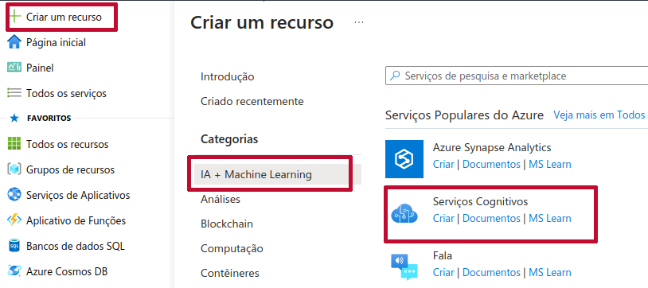

 

Em seguida navegue pelo menu esquerdo selecionando `IA + Machine Learning` e clique em `Criar` na opção **Serviços Cognitivos**.

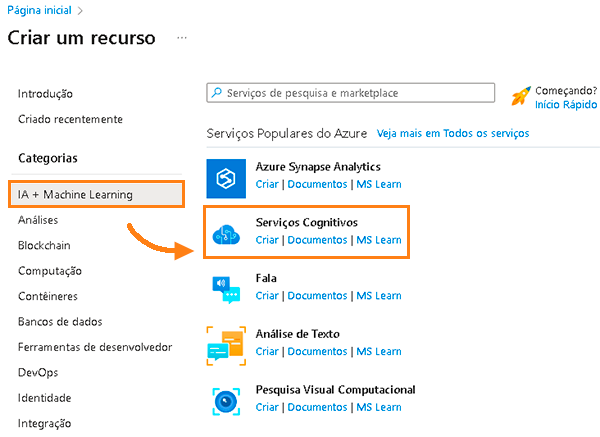

 

Feito isso a página **Criar Serviços Cognitivos** será carregada e as opções de configuração usadas para atender essa necessidade foram:

 *Lembre que é importante configurar corretamente um recurso para aproveitar ao máximo os benefícios da nuvem*. ☁️

  

## 🗺️ Acessando o Vision Studio

Feita a devida configuração do recurso é hora de acessar o novo [Azure AI - Vision Studio](https://portal.vision.cognitive.azure.com/), essa poderosa ferramenta permite explorar, criar e integrar recursos de visão computacional do Azure em aplicativos, sem a necessidade de programação. 

As possibilidades vão desde ***Reconhecimento de Produto por Análise de Imagem 4.0, Tokens de acesso limitado por Detecção Facil*** até ***SDK de Análise de Imagem da Visão de IA***.

Para esse desafio usaremos o ***Reconhecimento Óptico de Caracteres***, ao acessar o portal, clique em  `Ver todos recursos`.

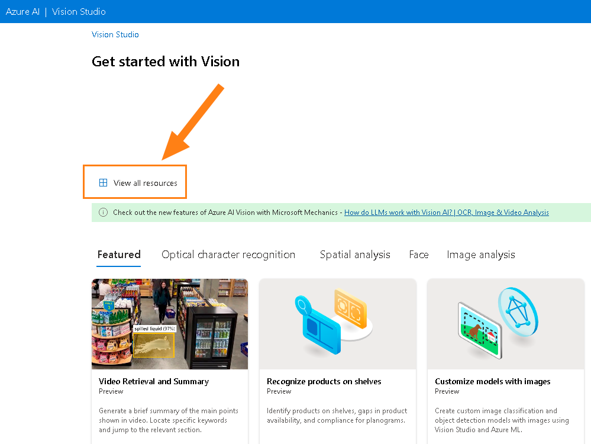

 

Na página que se abre selecione o recurso que já foi criado anteriormente e clicar no botão `Select as default resource` como mostra o exemplo:

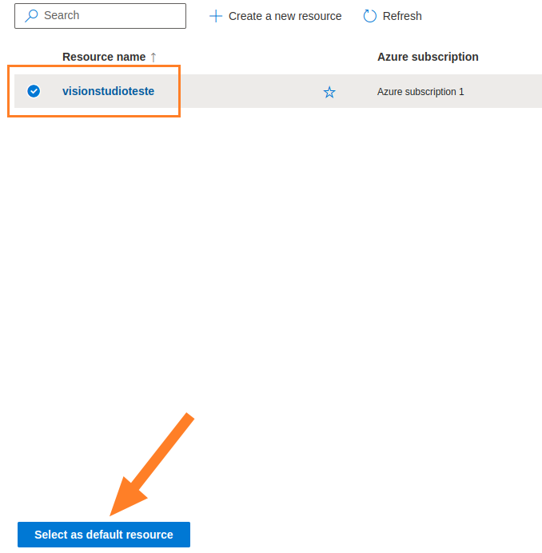

 

## 🪪 Imagens para input

Antes de partir para o próximo passo irei apresentar os 3 tipos de imagens que selecionei visando validar a capacidade do OCR do Azure AI de analisar de forma rápida e precisa usando seus modelos avançados de aprendizado de maquina.

A ideia é apresentar diferentes cenários e necessidades frente a essa ferramenta que facilita a incorporação de recursos de visão computacional em IA para os mais variados segmentos.

 

### Foto ou video de ambiente

A ideia é validar o quão capaz a solução é de detectar objetos, reconhecer e extrair texto por foto ou video de ambientes internos e em tempo real usando visão computacional.

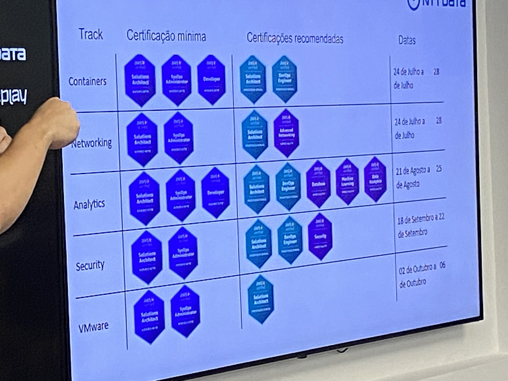

 

### Leitura de imagem

Testar a possibilidade para reconhecimento e capitação de conteúdo de documentos, podendo ser esse arquivos pdf, print, imagem ou impresso.

 

 

### Escrita a mão

Compreender se a tecnologia é capaz de extrair texto de documentos manuscritos, seja esse um orçamento ou prontuario médico, entre outros.

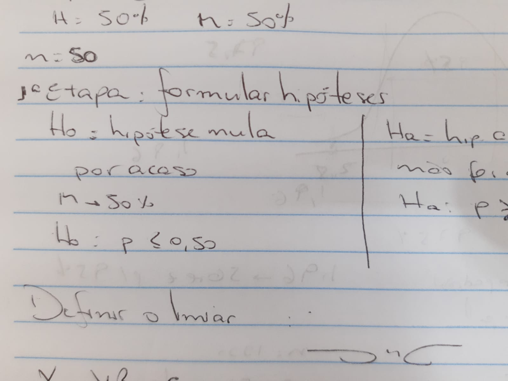

 

## 🤖 Acessando o OCR do Azure AI

Feita as configurações de recurso, do Vision Studio e o entendimento das imagens que serão usadas para input do Reconhecimento Óptico de Caracteres do Azure AI é hora de colocar a mão na massa.

Na página inicial do Vision Studio, selecione a opção `Optical character recognition`, após isso clique em `Extract text from images` como mostra o print:

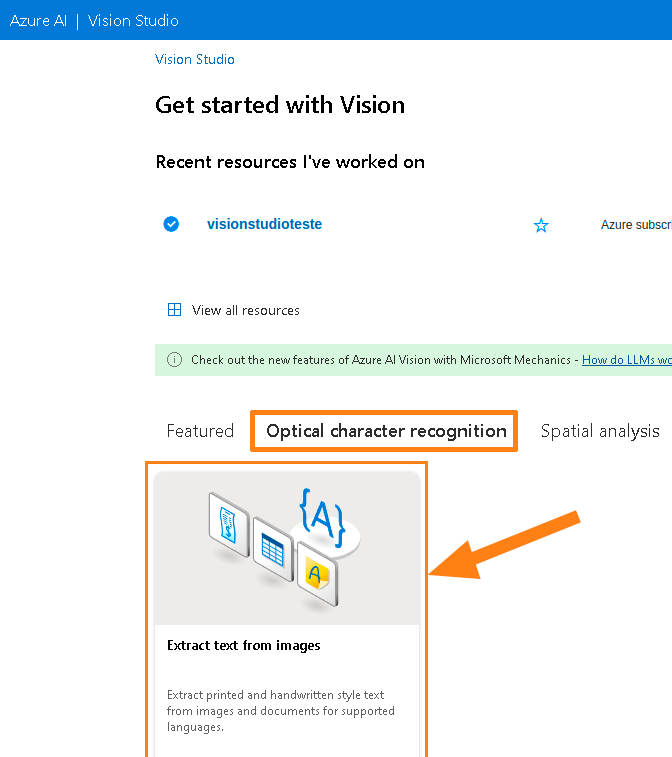

 

Na página que se abre, habilite o `Try it out` e em seguida clique em `Browse for a file`, para selecionar a imagem que deseja usar. Como mostrado no exemplo:

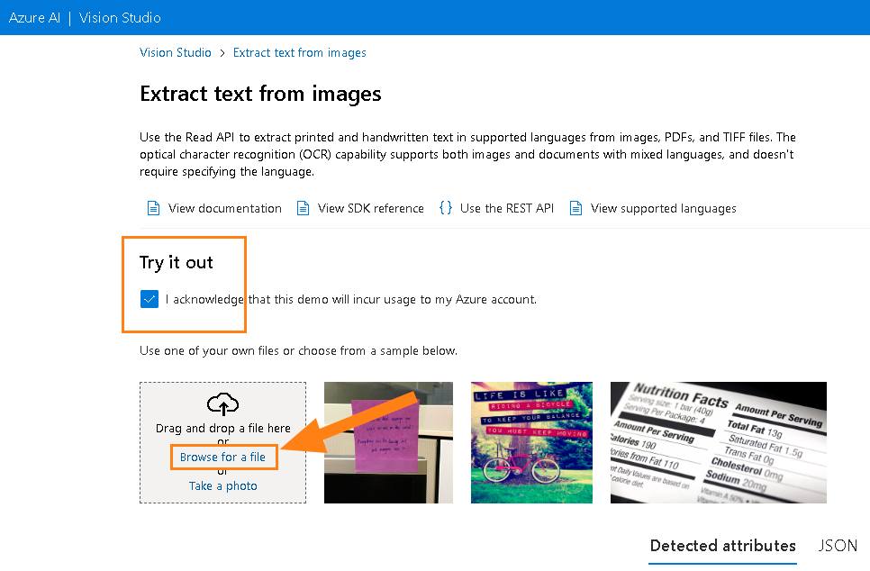

🔹*Logo após a imagem selecionada ser carregada, a identificação e extração de texto acontece instantaneamente*.

 

## 🔎 Analisando os outputs

### Ambiente

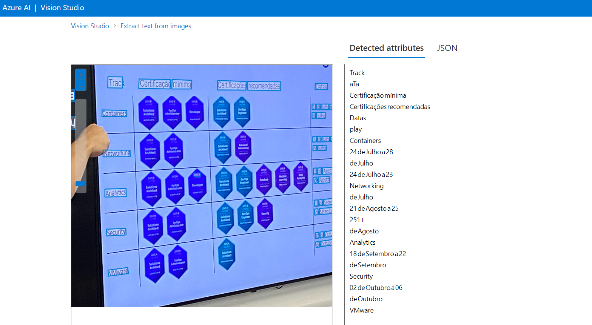

 

### Leitura de imagem

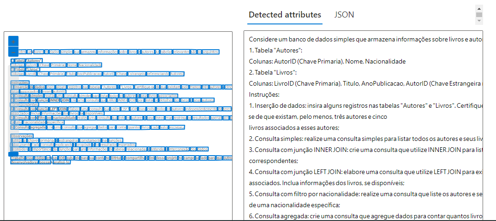

 

### Escrita a mão

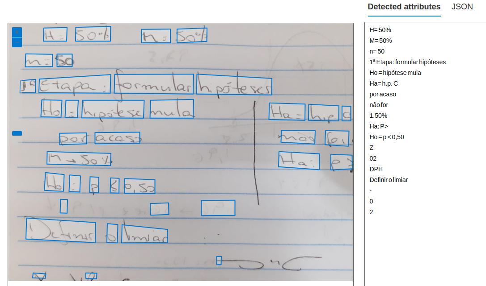

 

## 🧠 Conclusão 

O OCR do Azure é um recurso de inteligencia artificial avançado que permite extrair texto de imagens e documentos de forma rápida e precisa, usando modelos avançados de aprendizado de máquina. Oferecendo várias edições e opções de implantação para atender a diferentes cenários e necessidades, como imagens gerais, documentos digitais e digitalizados, vídeos e muito mais.

Com suporte para mais de 50 idiomas, incluindo idiomas e estilos de escrita misturados, podendo reconhecer texto impresso e manuscrito. Podendo ser integrado a outros serviços de IA do Azure, como o Document Intelligence, que extrai informações adicionais e insights dos documentos.

Seu poder de processamento e flexibilidade facilita a incorporação de recursos de visão computacional para aplicativos e sistemas via API.

Sua agilidade se reflete na capacidade de processar imagens e documentos em questão de segundos, com alta precisão e confiabilidade. 

Sua capacidade de adaptação às mudanças nas condições de iluminação, orientação, resolução e qualidade das imagens, mantem um bom desempenho para as mais variadas situações. 

A possibilidade de escolher entre uma API síncrona ou assíncrona, dependendo da complexidade e do tamanho dos dados de entrada, colabora na otimização do tempo de resposta e consumo de recursos.

Em resumo, o emprego dessa tecnologia para empresas que bucam escalar com eficiência e economia de tempo e recurso se deve a fatores como:

- Automatizar o processamento de documentos, reduzindo a necessidade de entrada manual de dados, o que aumenta a produtividade, a precisão e a segurança das informações.

- Extrair textos de qualquer imagem, em qualquer idioma, em questão de segundos, agilizando o acesso e a análise das informações, facilitando a tomada de decisões e a geração de valor.

- Permitir escolher entre APIs, variando de acordo com a complexidade e do tamanho dos dados de entrada, o que otimiza o tempo de resposta e o consumo de recursos.

- Permitir escolher entre um serviço de nuvem ou contéiner local, dependendo das preferências e dos requisitos de implantação, o que oferece flexibilidade e escalabilidade.

 

## 📚 Referências:

- Microsoft Azure - [*Soluções*](https://azure.microsoft.com/pt-br/#solutions)

- Read text in Vision Studio - [*Microsoft Learn*](https://microsoftlearning.github.io/mslearn-ai-fundamentals/Instructions/Labs/05-ocr.html)

- (OCR) Reconhecimento Óptico de Caracteres - [*Microsoft Learn*](https://learn.microsoft.com/pt-br/azure/azure-video-indexer/ocr)

- API da Visão de IA do Azure - [Documentação](https://learn.microsoft.com/pt-br/azure/ai-services/computer-vision/)

   

*Estudo densenvolvido com* 🎲🎲 *apoiado pela [R3](https://ruatrez.com)*